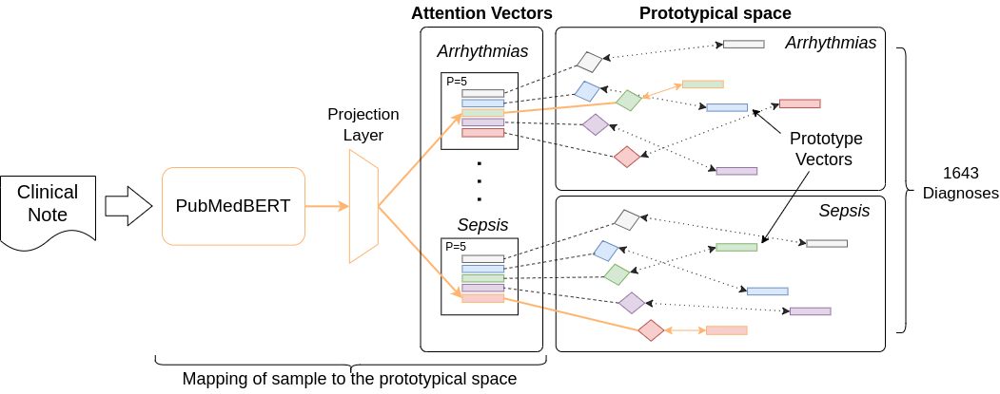
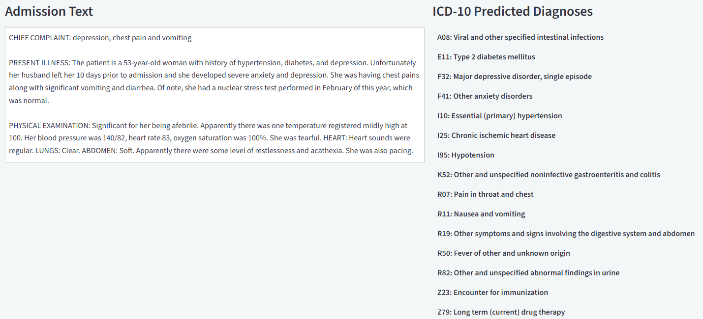

# S-Proto: Sparse Prototypical Networks for Long-Tail Clinical Diagnosis Prediction

**Published at ECML PKDD 2024 (CORE A)**  
*Boosting Long-Tail Data Classification with Sparse Prototypical Networks*

Alexei Figueroa*, Jens-Michalis Papaioannou*, et al.  
DATEXIS, Berliner Hochschule für Technik, Feinstein Institutes, TU Munich, Leibniz University Hannover  
(* equal contribution)



This repository provides **S-Proto**, a sparse and interpretable prototypical network for extreme multi-label diagnosis prediction from clinical text. The model is designed to address the long-tail distribution of clinical diagnoses while preserving faithful, prototype-based explanations.

## Interactive Demo

You can explore the model's predictions and interpretability features through our interactive web demo:
**[https://s-proto.demo.datexis.com/](https://s-proto.demo.datexis.com/)**

S-Proto was introduced in the paper:

**[Boosting Long-Tail Data Classification with Sparse Prototypical Networks](https://ecmlpkdd-storage.s3.eu-central-1.amazonaws.com/preprints/2024/lncs14947/lncs14947435.pdf)**
European Conference on Machine Learning and Principles and Practice of Knowledge Discovery in Databases (ECML PKDD 2024, CORE A)  
Alexei Figueroa*, Jens-Michalis Papaioannou*, et al.  
DATEXIS, Berliner Hochschule für Technik, Feinstein Institutes, TU Munich, Leibniz University Hannover  
(* equal contribution)

## Overview

Clinical outcome prediction from Electronic Health Records is characterized by extreme label imbalance. A small number of diagnoses account for most patients, while the majority of diagnoses appear rarely. Standard transformer classifiers tend to perform well on frequent diagnoses but degrade sharply in the long tail.

S-Proto addresses this problem by extending prototypical networks with:

- Multiple prototypes per diagnosis  
- Sparse winner-takes-all activation  
- Prototype-level interpretability  
- Efficient training despite increased representational capacity  

The model achieves state-of-the-art performance on MIMIC-IV diagnosis prediction, with particularly strong gains in PR-AUC for rare diagnoses, and transfers successfully to unseen clinical datasets.

## Model Architecture

S-Proto builds on **PubMedBERT** as the text encoder and introduces a sparse prototypical layer on top.

For each diagnosis label, the model learns multiple sub-networks, each consisting of:

- A label-specific attention vector  
- A prototype vector representing a prototypical patient  

Given an input clinical note:

1. The note is encoded using PubMedBERT  
2. Token embeddings are projected into a latent space  
3. Each diagnosis activates multiple candidate sub-networks  
4. A winner-takes-all mechanism selects the single most relevant sub-network per diagnosis  
5. Only the winning prototype contributes to the prediction and receives gradient updates  

This allows S-Proto to model heterogeneous disease phenotypes while remaining sparse and efficient.

## Intended Use

This model is intended for:

- Clinical diagnosis prediction from admission notes  
- Research on long-tail learning in healthcare NLP  
- Interpretable clinical decision support systems  
- Analysis of disease phenotypes via learned prototypes  

This model is **not intended for direct clinical deployment** without external validation, auditing, and regulatory approval.

## Requirements

The model depends on the base `sproto` package (which contains `MultiProtoModule`) and specific versions of its dependencies. Version mismatches — especially in `torchmetrics` and `pytorch-lightning` — will cause `AttributeError` or import failures.

```bash
pip install torch>=1.12.1 \
            transformers>=4.25.1 \
            torchmetrics>=0.10.1 \
            pytorch-lightning==1.9
```

| Package | Required version | Reason |
|---------|-----------------|--------|
| `torch` | `>= 1.12.1` | Minimum version for `nn.PairwiseDistance` and `torch.einsum` patterns used in the prototype layer |
| `transformers` | `>= 4.25.1` | Minimum version with `trust_remote_code` + `auto_map` support for custom model loading |
| `torchmetrics` | `>= 0.10.1` | `MultilabelAveragePrecision` was added in 0.10; older versions raise `AttributeError` on load |
| `pytorch-lightning` | `== 1.9` | `MultiProtoModule` is a `pl.LightningModule`; the exact API (e.g. `validation_epoch_end`) changed in 2.x |
| `sproto` | bundled | The `sproto/` package is included in this HF repo and downloaded automatically with `trust_remote_code=True` — no separate install needed |

## Inference Example

```python
from transformers import AutoTokenizer, AutoModel
import torch

tokenizer = AutoTokenizer.from_pretrained("DATEXIS/sproto")
model = AutoModel.from_pretrained("DATEXIS/sproto", trust_remote_code=True)
model.eval()

text_input = [
    "CHIEF COMPLAINT: Right Carotid Artery Stenosis. "
    "PRESENT ILLNESS: Ms. ___ is a ___ year old woman with hyperlipidemia, "
    "cirrhosis with esophageal varices, alcoholism, COPD, left eye blindness, "
    "and right carotid stenosis status post right carotid endarterectomy."
]

inputs = tokenizer(
    text_input,
    padding=True,
    truncation=True,
    max_length=512,
    return_tensors="pt"
)

tokens = [tokenizer.convert_ids_to_tokens(ids) for ids in inputs["input_ids"]]

with torch.no_grad():
    output = model(
        input_ids=inputs["input_ids"],
        attention_mask=inputs["attention_mask"],
        token_type_ids=inputs.get("token_type_ids"),
        tokens=tokens
    )

logits = output["logits"]
max_indices = output["max_indices"]
metadata = output["metadata"]

print("Inference successful")
print("Logits shape:", logits.shape)
print("Max indices:", max_indices)
print("Metadata:", metadata)
```

> **Note:** `tokens` (the list of token strings per sample) is **required** when `use_attention=True`
> (which is the default). The attention mechanism uses the actual token strings to mask clinical
> section headers (`[CLS]`, `[SEP]`, `"chief complaint :"`, etc.) before computing
> token-to-prototype attention. Omitting `tokens` will raise a `ValueError`.
> Obtain them with `tokenizer.convert_ids_to_tokens(input_ids[i])` as shown above.

## Outputs

The model returns a dictionary with the following entries:

- **logits**  
  Prediction scores per diagnosis label.

- **max_indices**  
  Index of the winning prototype sub-network per diagnosis, corresponding to the selected prototype.

- **metadata**  
  Additional information useful for analysis and interpretability.




## Post-Processing & Label Thresholding

S-Proto outputs predictions over **1,643 individual ICD-10 diagnosis classes**. To map the raw class indices back to actual diagnosis codes and filter out low-confidence predictions, you should use the `thresholds_per_label.json` file.

Because S-Proto was trained on highly imbalanced, long-tail data, using a single global probability threshold (e.g., > 0.50) will miss rare diseases. Instead, the model uses **class-specific thresholds**. 

**Important Thresholding Quirk:** 
If a specific label has its threshold set to exactly `0.0` in the JSON file (which typically happens for extremely rare diseases with no validation positives), you should manually fall back to a reasonable default (e.g., `0.20`) during inference. If you strictly apply `probability > 0.0`, the neural network's sigmoid function will falsely trigger for every patient.

## Explainability

S-Proto provides built-in faithful explanations through its prototypical structure:

- Attention vectors highlight clinically relevant tokens  
- Prototype distances reflect similarity to prototypical patients  
- Multiple prototypes per diagnosis capture disease subtypes and cohorts  
- Faithfulness metrics remain comparable to ProtoPatient despite higher capacity  

Qualitative evaluation with medical professionals confirms that learned prototypes often correspond to clinically meaningful phenotypes.

## Training

First, clone the repository:

```bash
git clone https://github.com/DATEXIS/sproto.git
cd sproto
```

Set up the environment using Poetry:

```bash
poetry install
```

Activate the virtual environment:

```bash
poetry env activate
```

Once the environment is active, you can start training by running the train command with the desired arguments.

Example:

```bash
train \
  --batch_size 3 \
  --pretrained_model microsoft/biomednlp-pubmedbert-base-uncased-abstract-fulltext \
  --pretrained_model_path path_to_pretrained_model.ckpt \
  --model_type MULTI_PROTO \
  --train_file training_data.csv \
  --val_file validation_data.csv \
  --test_file test_data.csv \
  --save_dir ../experiments/ \
  --gpus 1 \
  --check_val_every_n_epoch 2 \
  --num_warmup_steps 0 \
  --num_training_steps 50 \
  --max_length 512 \
  --lr_features 0.000005 \
  --lr_prototypes 0.001 \
  --lr_others 0.001 \
  --num_val_samples None \
  --use_attention True \
  --reduce_hidden_size 256 \
  --all_labels_path all_labels.pcl \
  --seed 42 \
  --label_column labels \
  --metric_opt auroc_macro \
  --train_files [] \
  --val_files [] \
  --only_test True \
  --model_name 5p \
  --store_metadata False \
  --num_prototypes_per_class 5
```

## Citation

```bibtex
@inproceedings{figueroa2024sproto,
  title={Boosting Long-Tail Data Classification with Sparse Prototypical Networks},
  author={Figueroa, Alexei and Papaioannou, Jens-Michalis and Fallon, Conor and Bekiaridou, Alexandra and Bressem, Keno and Zanos, Stavros and Gers, Felix and Nejdl, Wolfgang and Löser, Alexander},
  booktitle={Proceedings of the European Conference on Machine Learning and Principles and Practice of Knowledge Discovery in Databases (ECML PKDD)},
  year={2024}
}
```

## License

This model and its associated code are released under the Apache License 2.0.

The model was trained on the MIMIC-IV dataset, which is subject to restricted access. No training data is included or redistributed with this repository.
The data were accessed under a data use agreement. No patient-identifiable information is shared.

Use of this model must comply with all applicable data governance and ethical guidelines.

### Limitations

- Extremely rare diagnoses remain challenging  
- Clinical dataset biases may be reflected in predictions  
- Winner-takes-all selection is fixed and not learned dynamically  
- Not validated for real-world clinical deployment  

### Ethical Considerations

- The model processes sensitive clinical text  
- Predictions should always be reviewed by qualified professionals  
- Outputs should not be used as sole evidence for clinical decisions  
- Care must be taken to avoid reinforcing existing healthcare biases